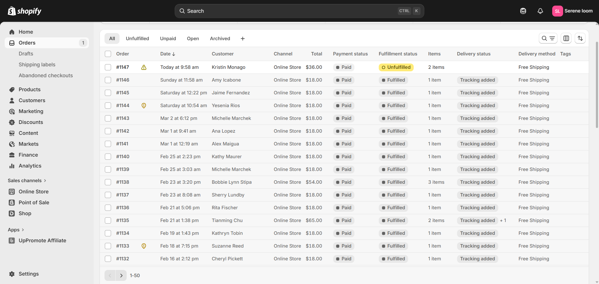

<div align="center">

# 🛒 Shopify Marketing Portfolio
### Fawaz Opeyemi | Shopify Marketing Specialist

[](https://fawassopeyemi01.systeme.io/)
[](https://www.fiverr.com/fawasopeyemi_01)
[](https://www.linkedin.com/in/fawasopeyemi01)

</div>

---

## 📌 Overview

This repository showcases my real client work in Shopify marketing — including store design, email marketing automation, Klaviyo flows, social media promotion, and order management systems. Every sample here is from an actual client project.

---

## 🛠️ What I Built

### Shopify Store Marketing
- Complete marketing strategy tailored to your niche
- Social media promotion across Facebook, Instagram, TikTok, and Pinterest
- Email marketing automation setup using Klaviyo
- Landing page design for conversions
- Abandoned cart recovery setup
- Retargeting strategy for returning visitors

### Shopify Store Design
- Professional custom theme setup
- Product page optimization
- Mobile-responsive design
- Navigation and UX improvements
- Payment gateway integration
- App installation and configuration

---

## ⚙️ My Process
```
Step 1 → Store Audit
         Review existing store for
         conversion issues and gaps

Step 2 → Audience Research
         Define target audience and
         buying behaviour

Step 3 → Marketing Strategy
         Build a complete plan covering
         traffic, email, and social media

Step 4 → Implementation
         Execute the strategy — set up
         email flows, social campaigns,
         and landing pages

Step 5 → Optimization
         Monitor performance and
         optimize for better conversions

Step 6 → Scale
         Expand what is working across
         more products and channels
```

---

## 🛠️ Tools I Use

| Category | Tools |
|---|---|
| Email Marketing | Klaviyo, Mailchimp |
| Automation | Zapier, Make.com |
| Social Media | Facebook, Instagram, TikTok, Pinterest |
| Store Platform | Shopify |
| Analytics | Google Analytics, Shopify Analytics |
| Design | Canva, Shopify Theme Editor |

---

## 📸 Portfolio Samples

### 🏪 Store Design Samples

These are real Shopify store designs built for clients across different niches.

📄 [Genesis Store — PDF Sample](Genesis-sample-PDF.pdf)

📄 [Sherry's Favorites Store — PDF Sample](Sherrys-Favorites-sample-PDF.pdf)

📄 [The Plant Prep Store — PDF Sample](The-Plant-Prep-PDF-Sample.pdf)

---

### 📧 Klaviyo Email Marketing Samples

Complete email marketing automation flows built inside Klaviyo for real clients.

📄 [Klaviyo Email Marketing Sample](Genesis-Pop-up-Form.png)


---

### 🛒 Shopify Order Management

Real Shopify order management and store backend samples.



---

### 📱 Social Media Awareness (Shop Promotion)

Social media promotion campaigns built to drive traffic to Shopify stores.


---

## 📊 Case Study — Shopify Store Marketing

**Client:** eCommerce store owner in the kitchen products niche
**Challenge:** Store had traffic but very low conversion rate
**Solution:**
- Audited the store and identified conversion blockers
- Set up Klaviyo email flows — welcome series, abandoned cart, and win-back
- Created a social media promotion strategy for Instagram and Pinterest
- Redesigned the landing page for better conversion
- Implemented a retargeting strategy

**Result:** Complete email marketing system and social media strategy delivered and live within 7 days.

---

## 📊 Case Study — Shopify Store Design

**Client:** New entrepreneur launching an eCommerce business
**Challenge:** Needed a complete professional Shopify store built from scratch
**Solution:**
- Selected and customized a premium Shopify theme
- Built all product pages with SEO-optimized descriptions
- Integrated payment gateway and shipping settings
- Set up email capture pop-up and welcome sequence
- Connected social media accounts and Google Analytics

**Result:** Complete professional Shopify store delivered within 5 days — fully set up and ready to sell.

---

## ⭐ Client Reviews

> *"Working with Fawaz was a pleasure experience. He connected up the social media accounts to my Shopify store, Google Analytics & domain integration. The work was completed in a short time frame which shows how experienced he is at his field."*
> — ⭐⭐⭐⭐⭐ Verified Fiverr Client

> *"I had an excellent experience with this freelancer. This person definitely knows their stuff and can provide you with such great service and knowledge. My project came out way better than I expected. I would highly highly recommend you work with this person if you want things done right and you want them done on time."*
> — ⭐⭐⭐⭐⭐ Verified Fiverr Client

> *"Fawaz did a phenomenal job setting up my email campaign and marketing campaigns. I will definitely recommend him. He completed it earlier than scheduled time. He was very knowledgeable on the different systems needed. I recommend his services."*
> — ⭐⭐⭐⭐⭐ Verified Fiverr Client

---

## 💼 Services & Availability

I am currently available for freelance projects, long-term collaborations, and partnerships.

For pricing and packages, visit my **[Fiverr profile](https://www.fiverr.com/fawasopeyemi_01)** or **[contact me directly](https://fawassopeyemi01.systeme.io/)**.

---

## 📬 Work With Me

| Platform | Link |
|---|---|
| 🌐 Website | [fawassopeyemi01.systeme.io](https://fawassopeyemi01.systeme.io/) |
| 💼 Fiverr | [fiverr.com/fawasopeyemi_01](https://www.fiverr.com/fawasopeyemi_01) |
| 💬 LinkedIn | [linkedin.com/in/fawasopeyemi01](https://www.linkedin.com/in/fawasopeyemi01) |
| 📸 Instagram | [instagram.com/fawassopeyemi_01](https://www.instagram.com/fawassopeyemi_01/) |
| 🐦 Twitter/X | [x.com/fawasopeyemi_01](https://x.com/fawasopeyemi_01) |

---

<div align="center">

**⚡ 1-Hour Response Time · 📍 Nigeria · 🌍 Serving Clients Worldwide**

*© 2025 Fawaz Opeyemi Digital Marketing · [fawassopeyemi01.systeme.io](https://fawassopeyemi01.systeme.io/)*

</div>
